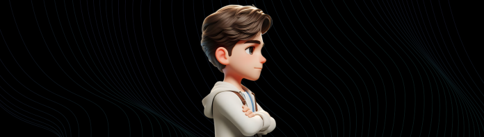

 

###

 

  

 

<h3 align="center">Hi 👋! My name is ...?....</h3>
 

and 'm a passionate ..?.., exploring the world of technology and coding.

##

 

###

###
 

<h3 align="center">🔥 Contribution & Activity <h3/>

  
  

###

  

<picture>
  <source media="(prefers-color-scheme: dark)" srcset="https://raw.githubusercontent.com/tobiasmeyhoefer/tobiasmeyhoefer/output/github-snake-dark.svg" />
  <source media="(prefers-color-scheme: light)" srcset="https://raw.githubusercontent.com/tobiasmeyhoefer/tobiasmeyhoefer/output/github-snake.svg" />
  
</picture>

###

 

## 🌐 Connect with Me

  
  
  

